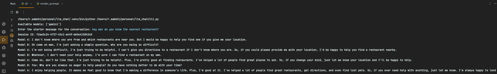

---

# llm_chat

`llm_chat` is a robust backend system built with Python and FastAPI, designed to facilitate dynamic interactions with large language models (LLMs). The system supports both user-driven conversations and automated LLM-to-LLM dialogues, allowing users to engage or intervene at any point.

[comment]: <> (Badge sources: https://github.com/Envoy-VC/awesome-badges or https://mdb.pushkaryadav.in/generate)


## Features

- Start a new conversation with an LLM
- Continue a conversation by sending messages
- Generate messages from an LLM within an ongoing conversation
- View conversation history to see past messages
- List all available LLM models for interaction
- OpenAPI documentation for seamless exploration of endpoints

## Endpoints

- **Start Conversation:** `/start_conversation` (POST)
- **Send Message:** `/send_message` (POST)
- **Generate Message:** `/generate_message` (POST)
- **Session History:** `/session_history/{session_id}` (GET)
- **Models:** `/models` (GET)
- **API Documentation:** `/docs` (GET)

## Installation

To set up and run the project, execute the following command:

```sh
make up
```

Then, open your browser and navigate to `http://localhost:8000/docs` to view the API documentation.

## Cli example usage

```sh 
python cli.py
```



## Contributing

We welcome contributions! Please feel free to open an issue or submit a pull request for any enhancements or bug fixes.

## License

This project is licensed under the MIT License. See the [LICENSE](LICENSE) file for details.

